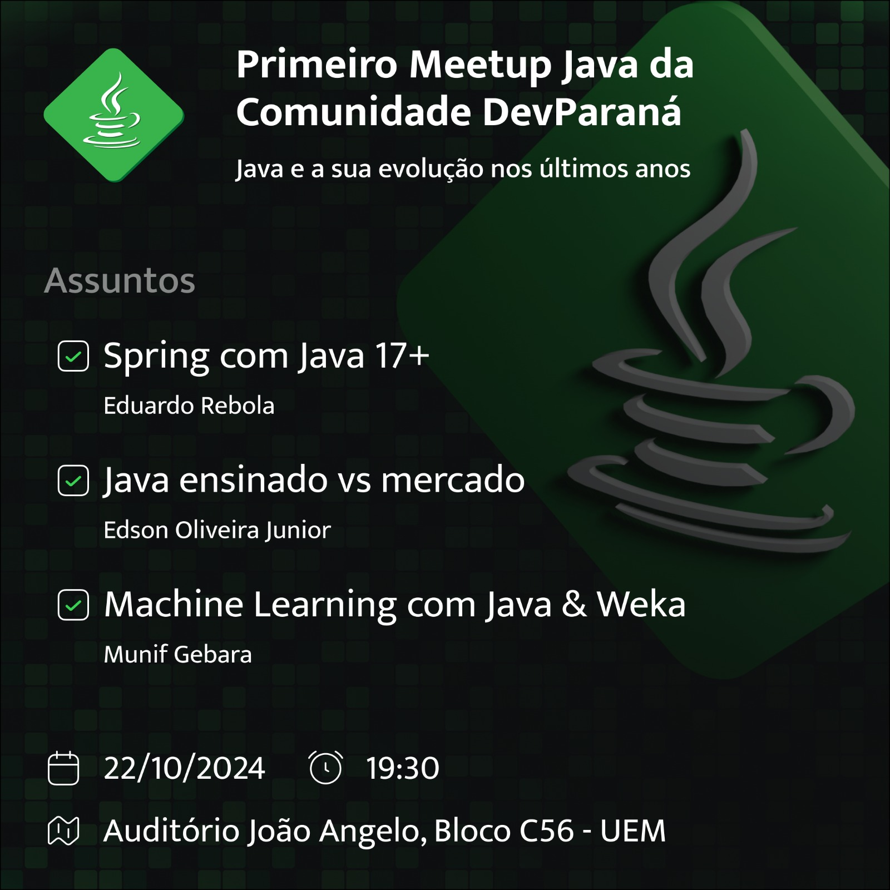

# Spring com Java 17+

### [Slides da apresentação (PDF)](./static/slides.pdf)

## Proposta

Passar algumas dicas de como se desenvolver com o foco em use-cases (ou user stories, como preferir). 
Em uma API REST, por exemplo, cada endpoint seria um use-case.

// TODO complementar

## Como subir?

O projeto foi gerado utilizando [Spring Initializr](https://start.spring.io/) optando por Maven e Java 23. 
Também é preciso estar com o Docker rodando.

// TODO complementar
